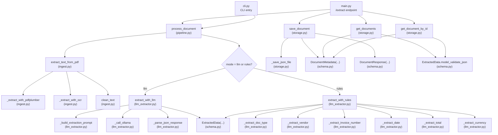

```mermaid
flowchart TD
  %% ===== Entry Points =====
  A1["main.py\n/extract endpoint"] --> A2["process_document\n(pipeline.py)"]
  A3["cli.py\nCLI entry"] --> A2

  %% ===== Pipeline =====
  A2 --> B1["extract_text_from_pdf\n(ingest.py)"]
  B1 --> B2["_extract_with_pdfplumber\n(ingest.py)"]
  B1 --> B3["_extract_with_ocr\n(ingest.py)"]
  B1 --> B4["clean_text\n(ingest.py)"]

  %% ===== Extraction Mode Switch =====
  A2 --> C1{mode = llm or rules?}
  C1 -->|llm| D1["extract_with_llm\n(llm_extractor.py)"]
  C1 -->|rules| D2["extract_with_rules\n(llm_extractor.py)"]

  %% ===== LLM Mode Path =====
  D1 --> D3["_build_extraction_prompt\n(llm_extractor.py)"]
  D1 --> D4["_call_ollama\n(llm_extractor.py)"]
  D1 --> D5["_parse_json_response\n(llm_extractor.py)"]
  D1 --> E1["ExtractedData(...)\n(schema.py)"]

  %% ===== Rules Mode Path =====
  D2 --> R1["_extract_doc_type\n(llm_extractor.py)"]
  D2 --> R2["_extract_vendor\n(llm_extractor.py)"]
  D2 --> R3["_extract_invoice_number\n(llm_extractor.py)"]
  D2 --> R4["_extract_date\n(llm_extractor.py)"]
  D2 --> R5["_extract_total\n(llm_extractor.py)"]
  D2 --> R6["_extract_currency\n(llm_extractor.py)"]
  D2 --> E1["ExtractedData(...)\n(schema.py)"]

  %% ===== Storage =====
  A1 --> S1["save_document\n(storage.py)"]
  S1 --> S2["_save_json_file\n(storage.py)"]
  S1 --> S3["DocumentMetadata(...)\n(schema.py)"]
  S1 --> S4["DocumentResponse(...)\n(schema.py)"]

  %% ===== Read Endpoints =====
  A1 --> G1["get_documents\n(storage.py)"]
  A1 --> G2["get_document_by_id\n(storage.py)"]
  G1 --> S3
  G2 --> S3
  G1 --> E2["ExtractedData.model_validate_json\n(schema.py)"]
  G2 --> E2
```